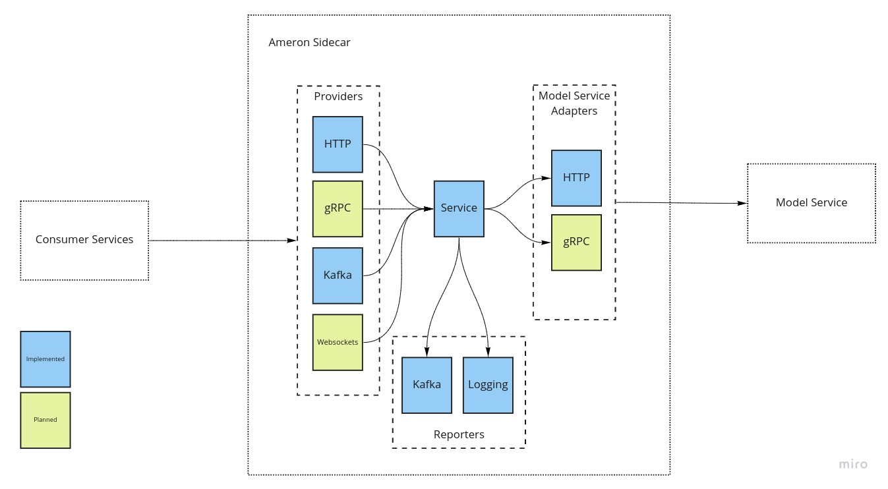

# Ameron Sidecar
## Overview
The Sidecar is a simple facade between your Models and clients of your Models. It takes care of several crosscutting DevOps and MLOps concerns for you. It does this through a lightweight Spring Boot application and standardized APIs.

It can be deployed in the same Docker Container as your Model Service or in a separate Docker Container.

This allows your Model serving code to stick to a single responsibility.

## Concepts
### Prediction
A Prediction is an output from a Machine Learning model, whether that is Classification, Regression or other.

A Model service may return more than a single Prediction. For example before classification an image may need to be rotated. Both of the Predictions should be recorded and tracked.

Each Prediction will have at minimum the following information:
- modelName
- modelVersion
- timeTakenInMs
- value

### Provider
A Provider exposes an API for clients to call to get Predictions. REST and Kakfa have been implemented.

### Model Service Adapter
A Model Service executes a Model. The Adapters provide a mechanism to call these Services. HTTP has been implemented.

### Prediction Reporter 
A Prediction Reporter sends Predictions for later usage. For example analysis by monitoring systems or for usage in training.

## Provider APIs
### Synchronous
- REST
### Asynchronous
- Kafka

## Model Service APIs
- HTTP

### Run
Run just the Sidecar:

    make run

Run the Sidecar, and a local Kafka and Zookeeper instances

    make run-all

# Roadmap
- Performance tests
- Increased Unit Test coverage
- CI/CD pipeline
- Model Service example
- Single Docker container for Model Service and Sidecar example
- Prediction schemas
- Feature schemas
- Asynchronous PredictionEvent consumers
- Kafka Security
- Kafka Avro
- Kafka Security
- gRPC Provider API
- gRPC Model Service API
- Websocket Model Service API
- Add Prediction/Request/Response etc timestamps
- Publish Docker image
- Publish to Maven Repo